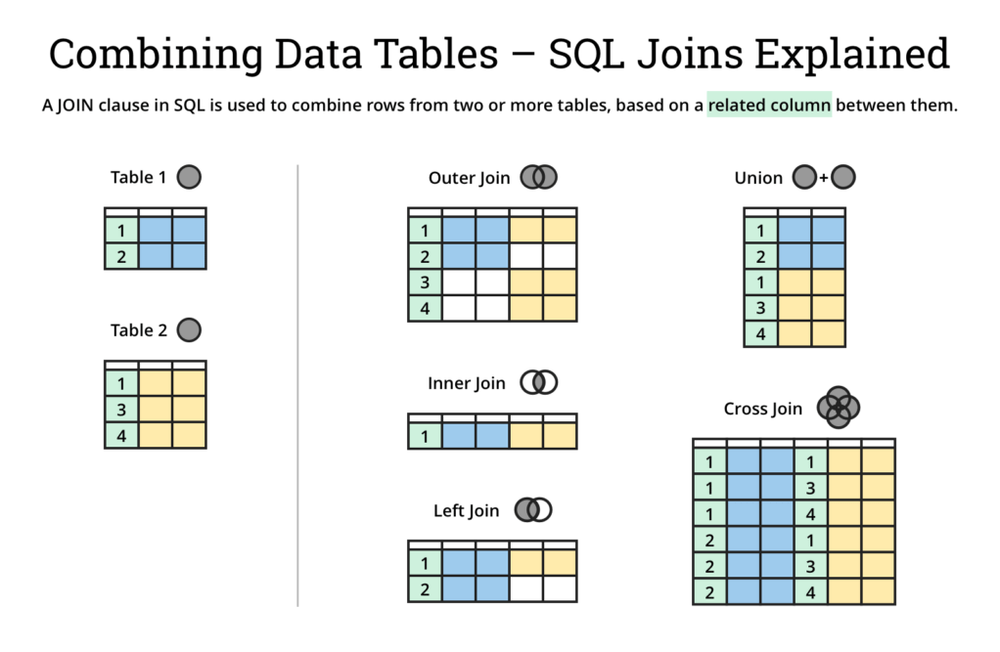

# Kaggle - Intro to SQL course - notes

## Загальні засади роботи з (великими) даними дистанційно

* Перевірити розмір бази, до якої хочеш вислати запит
* Перевірити опис бази (schema), щоб знати одразу (за можливості), що саме тобі треба
* Створити запит і перевірити його з dry-run
* Подивитися на перші N (~10 рядків): `list_rows()`
* Видрати лише потрібні стовпці
* Якщо все добре, вислати запит

> Де в коментарі є `API request`, відбувається запит до сервера (з відповіддю, звісно)

## 1 - Getting started

### First commands

```py
from google.cloud import bigquery

## Create a "Client" object
client = bigquery.Client()

## Construct a reference to the "openaq" dataset
dataset_ref = client.dataset("openaq", project="bigquery-public-data")
dataset_ref = client.dataset("hacker_news", project="bigquery-public-data")

## API request - fetch the dataset
dataset = client.get_dataset(dataset_ref)

## List all the tables in the "openaq" dataset
# так, так можна, виявляється
tables = list(client.list_tables(dataset))


## Print names of all tables in the dataset (there's only one!)
for table in tables:  
    print(table.table_id)

## Construct a reference to the "full" table
table_ref = dataset_ref.table("full")

## API request - fetch the table
table = client.get_table(table_ref)
```

### Structure overview


### Table schema

Description of columns in table.

Each SchemaField tells us about a specific column (which we also refer to as a field). In order, the information is:

* `name` -- The name of the column
* `field_type` -- The field type (or datatype) in the column
* `mode` -- The mode of the column ('NULLABLE' means that a column allows NULL values, and is the default)
* `description` -- A description of the data in that column
* `fields` -- subfields of a field (empty in first examples)


```py
# Print information on all the columns in the "full" table in the "hacker_news" dataset
tb_schema = table.schema

# field type of the first column in table
tb_schema[0].field_type # "TIMESTAMP", "INTEGER", etc
```

### Table to DataFrame

```py
# Preview the first five lines of the "full" table
client.list_rows(table, max_results=5).to_dataframe()

# Preview the first five entries in the "by" column of the "full" table
client.list_rows(table, selected_fields=table.schema[:1], max_results=5).to_dataframe()
```

### Get inforamtion about table (table properties)

More information: [Google Cloud Documentation - Tables - Getting information about tables](https://cloud.google.com/bigquery/docs/tables#getting_information_about_tables)

```py
# View table properties
print(
    "Got table '{}.{}.{}'.".format(table.project, table.dataset_id, table.table_id)
)
print("Table schema: {}".format(table.schema))
print("Table description: {}".format(table.description))
print("Table has {} rows".format(table.num_rows))
```


## 2 - Query - SELECT, FROM, WHERE

### Basic example

```py
# Query to select all the items from the "city" column where the "country" column is 'US'
# SELECT <column_name1>, <column_name2> FROM `<bq_project_name>.<dataset_name>.<table_name>` WHERE <condition>
# Names of columns are written without quotion marks
query = """
        SELECT city
        FROM `bigquery-public-data.openaq.global_air_quality`
        WHERE country = 'US'
        """

# Set up the query
query_job = client.query(query)

# API request - run the query, and return a pandas DataFrame
us_cities = query_job.to_dataframe()

# Explore DataFrame
us_cities.city.value_counts().head()
```

### LIKE

* for test can use `LIKE` for test data in `WHERE` clause
* `%` - wildcard for multiple characters


### Working with big datasets

> Be carefull to avoid exceeding of usage limit

#### Dry run - to check how much quota with be used

```py
# Query to get the score column from every row where the type column has value "job"
query = """
        SELECT score, title
        FROM `bigquery-public-data.hacker_news.full`
        WHERE type = "job" 
        """

# Create a QueryJobConfig object to estimate size of query without running it
dry_run_config = bigquery.QueryJobConfig(dry_run=True)

# API request - dry run query to estimate costs
dry_run_query_job = client.query(query, job_config=dry_run_config)

print("This query will process {} bytes.".format(dry_run_query_job.total_bytes_processed))
```

#### Limit on bytes to scan

```py
# Only run the query if it's less than 1 MB
ONE_MB = 1000*1000
safe_config = bigquery.QueryJobConfig(maximum_bytes_billed=ONE_MB)

# Set up the query (will only run if it's less than 1 MB)
safe_query_job = client.query(query, job_config=safe_config)

# API request - try to run the query, and return a pandas DataFrame
safe_query_job.to_dataframe()

```

Should through exception like this:


Enlarge limit to succeed.

```py

# Only run the query if it's less than 1 GB
ONE_GB = 1000*1000*1000
safe_config = bigquery.QueryJobConfig(maximum_bytes_billed=ONE_GB)

# Set up the query (will only run if it's less than 1 GB)
safe_query_job = client.query(query, job_config=safe_config)

# API request - try to run the query, and return a pandas DataFrame
job_post_scores = safe_query_job.to_dataframe()

# Print average score for job posts
job_post_scores.score.mean()
```

## 3 - GROUP BY, HAVING and COUNT()

### COUNT()

* returns a count of things
* an aggregate function: takes many values and returns one
* can use `COUNT(1)`
> other aggragate functions examples: `SUM()`, `AVG()`, `MIN()`, and `MAX()`


### GROUP BY

* takes the name of one or more columns
* treats all rows with the same value in that column as a single group when you apply aggregate functions
* makes no sense without aggregate function
* all variables (column names) must be used in either `GROUP BY` or aggregating function

Will work fine


Won`t work


### HAVING

* is used in combination with `GROUP BY` to ignore groups that don't meet certain criteria
* don't use `WHERE`


## 4 - ORDER BY, Dates, EXTRACT

### ORDER BY

* usually the last clause in a query
* can be used for text - alphabetical ordering
* `DESC` to reverse the order


### Dates

* `DATE` and `DATETIME` (date with time)
* format: `YYYY-[M]M-[D]D`

### EXTRACT()

* used to get only part of the data
* not only `YEAR`, `MONTH` or `DAY` can be ontained
* also `WEEK` (week of the year), `DAYOFWEEK` (1-Sunday...7-Saturday)


## 5 - AS & WITH

* used to tidy up your queries and make them easier to read

### AS

* used for aliasing column names to increase results readability

### WITH ... AS

* `common table expression` (or `CTE`)
* creates temporary table to use in current query
* temporary table itself is not return - it is only a part of bigger query

```py
# Query to select the number of transactions per date, sorted by date
# CTE used to convert full timestamps to dates
query_with_CTE = """ 
                 WITH time AS 
                 (
                     SELECT DATE(block_timestamp) AS trans_date
                     FROM `bigquery-public-data.crypto_bitcoin.transactions`
                 )
                 SELECT COUNT(1) AS transactions,
                        trans_date
                 FROM time
                 GROUP BY trans_date
                 ORDER BY trans_date
                 """
```

## 6 - JOIN

| INNER JOIN | LEFT OUTER JOIN | RIGHT OUTER JOIN | FULL OUTER JOIN |
|:---:|:---:|:---:|:---:|
|||||


* join data from two tables
* use common key
* JOIN types
    * `(INNER)`: keys are not NULL for both tables
    * `LEFT (OUTER)`: all keys from left table; all from the right which are not in left - dropped
    * `RIGHT (OUTER)`: only keys in right table; keys from left which are not in the right - dropped
    * `FULL (OUTER)`: all keys from left and right; empty values are replaced with `NULL`
    * `CROSS`: returns the Cartesian product of rows from tables in the join (кожен з кожним)

#### Example
Given tables


INNER JOIN example


#### Combine tables summary



Source: https://dataschool.com/how-to-teach-people-sql/sql-join-types-explained-visually/


## Additional Resources

* Як нотатки з цього курсу + корисні фішки: [Beyond Queries: Exploring the BigQuery API](https://www.kaggle.com/sohier/beyond-queries-exploring-the-bigquery-api)
* Приклад хмари слів: [Mentions of Kaggle on Hacker News](https://www.kaggle.com/mrisdal/mentions-of-kaggle-on-hacker-news)
* [How to query BigQuery datasets on Kaggle: Resources & documentation](https://www.kaggle.com/product-feedback/48573)
* Приклад зі стовпчатою діаграмою: [Safely Anlyse GitHub Projects](https://www.kaggle.com/mrisdal/safely-analyzing-github-projects-popular-licenses)
