# Kaggle - Advanced SQL course - notes

## 1 - JOINs and UNIONs

### JOINs

* combine tables horizontally

Working table for examples

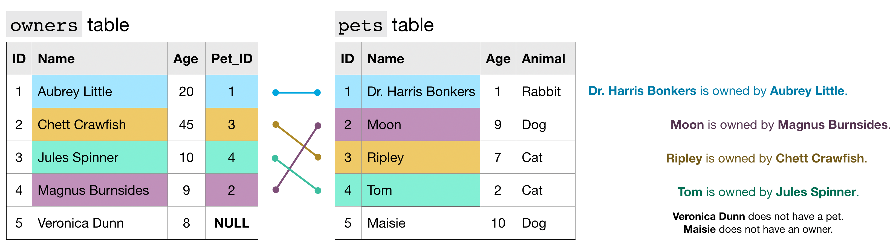

JOIN types recap

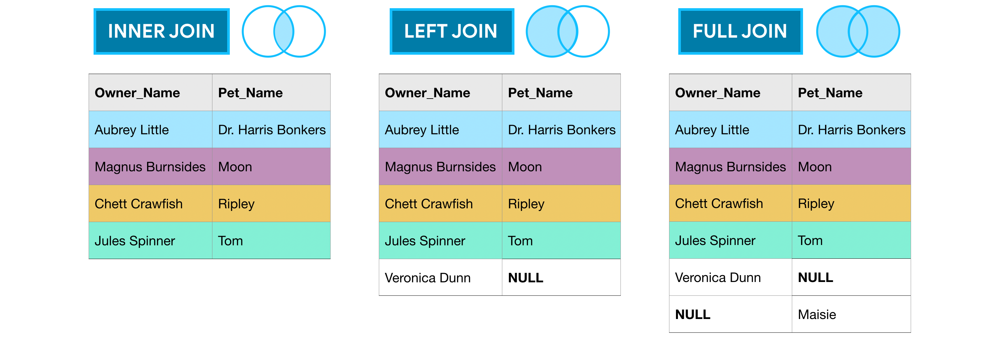

Multijoin example
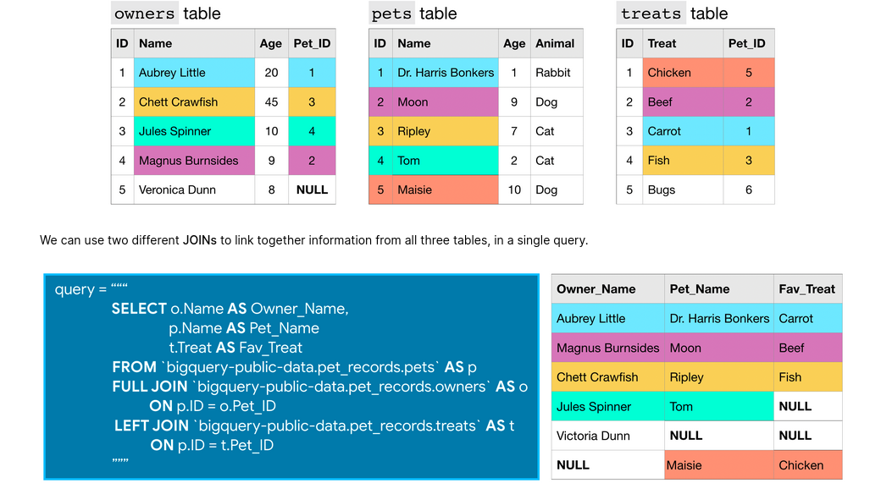


### UNIONs

* combine vertically
* column must have the same type
* column names can be different
* `UNION ALL` - keep duplicate values
* `UNION DISTINCT` - drop duplicates (does it drop duplicates from the first table too?)

```py
# Query to select all users who posted stories or comments on January 1, 2014
union_query = """
              SELECT c.by
              FROM `bigquery-public-data.hacker_news.comments` AS c
              WHERE EXTRACT(DATE FROM c.time_ts) = '2014-01-01'
              UNION DISTINCT
              SELECT s.by
              FROM `bigquery-public-data.hacker_news.stories` AS s
              WHERE EXTRACT(DATE FROM s.time_ts) = '2014-01-01'
              """

# Run the query, and return a pandas DataFrame
union_result = client.query(union_query).result().to_dataframe()
union_result.head()
```

## 2 - Analytic Functions (analytic window functions, window functions)

> _Definition of analytic (by Marriam-Webster dictionary)_
>
> 1. of or relating to analysis or analytics<br>_especially_: **separating something into component parts or constituent elements**

* operate on set of rows
* return a (potentially different) value for each row in the original table
* e.g. moving averages, running totals

### Syntax
* function (one of 3 types)
* uses `OVER` clause 
* and 3 optional parts:
  * `PARTITION BY` <columnname>
  * `ORDER BY` <columnname>
  * `window frame clause` 
    * `ROWS BETWEEN 1 PRECEDING AND CURRENT ROW` - the previous row and the current row.
    * `ROWS BETWEEN 3 PRECEDING AND 1 FOLLOWING` - the 3 previous rows, the current row, and the following row.
    * `ROWS BETWEEN UNBOUNDED PRECEDING AND UNBOUNDED FOLLOWING` - all rows in the partition


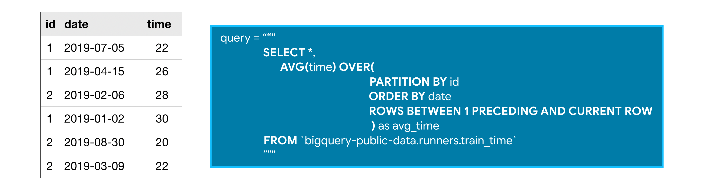

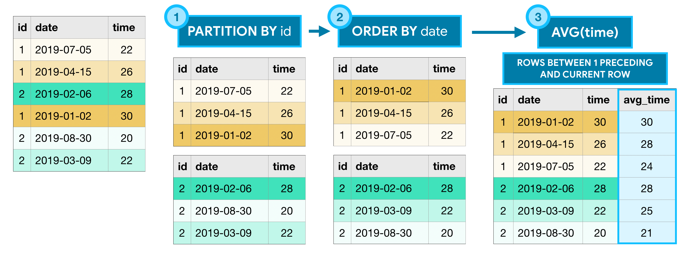

### Types of analitical functions

1) Analytic aggregate functions
   * `MIN()` (or `MAX()`) - Returns the minimum (or maximum) of input values
   * `AVG()` (or `SUM()`) - Returns the average (or sum) of input values
   * `COUNT()` - Returns the number of rows in the input

2) Analytic navigation functions
   * `FIRST_VALUE()` (or `LAST_VALUE()`) - Returns the first (or last) value in the input
   * `LEAD()` (and `LAG()`) - Returns the value on a subsequent (or preceding) row

3) Analytic numbering functions
   * `ROW_NUMBER()` - Returns the order in which rows appear in the input (starting with 1)
   * `RANK()` - All rows with the same value in the ordering column receive the same rank value, where the next row receives a rank value which increments by the number of rows with the previous rank value.

### Examples

#### Example 1

```py
# Query to count the (cumulative) number of trips per day
num_trips_query = """
                  WITH trips_by_day AS
                  (
                  SELECT DATE(start_date) AS trip_date,
                      COUNT(*) as num_trips
                  FROM `bigquery-public-data.san_francisco.bikeshare_trips`
                  WHERE EXTRACT(YEAR FROM start_date) = 2015
                  GROUP BY trip_date
                  )
                  SELECT *,
                      SUM(num_trips) 
                          OVER (
                               ORDER BY trip_date
                               ROWS BETWEEN UNBOUNDED PRECEDING AND CURRENT ROW
                               ) AS cumulative_trips
                      FROM trips_by_day
                  """

# Run the query, and return a pandas DataFrame
num_trips_result = client.query(num_trips_query).result().to_dataframe()
num_trips_result.head()
```

Out:

| |	trip_date |	num_trips |	cumulative_trips |
|---|---|---|---|
|0 |	2015-01-01 | 181 | 181 |
|1 |	2015-01-02 | 428 | 609 |
|2 |	2015-01-03 | 283 | 892 |
|3 |	2015-01-04 | 206 | 1098 |
|4 |	2015-01-05 | 1186 | 2284 |

#### Example 2


```py
# Query to track beginning and ending stations on October 25, 2015, for each bike
start_end_query = """
                  SELECT bike_number,
                      TIME(start_date) AS trip_time,
                      FIRST_VALUE(start_station_id)
                          OVER (
                               PARTITION BY bike_number
                               ORDER BY start_date
                               ROWS BETWEEN UNBOUNDED PRECEDING AND UNBOUNDED FOLLOWING
                               ) AS first_station_id,
                      LAST_VALUE(end_station_id)
                          OVER (
                               PARTITION BY bike_number
                               ORDER BY start_date
                               ROWS BETWEEN UNBOUNDED PRECEDING AND UNBOUNDED FOLLOWING
                               ) AS last_station_id,
                      start_station_id,
                      end_station_id
                  FROM `bigquery-public-data.san_francisco.bikeshare_trips`
                  WHERE DATE(start_date) = '2015-10-25' 
                  """

# Run the query, and return a pandas DataFrame
start_end_result = client.query(start_end_query).result().to_dataframe()
start_end_result.head()
```

Out:

|   | bike_number | trip_time | first_station_id | last_station_id | start_station_id | end_station_id |
| - | --------- | ---------------- | --------------- | ---------------- | ------------- | -- |
| 0 | 22        | 13:25:00         | 2               | 16               | 2             | 16 |
| 1 | 25        | 11:43:00         | 77              | 51               | 77            | 60 |
| 2 | 25        | 12:14:00         | 77              | 51               | 60            | 51 |
| 3 | 29        | 14:59:00         | 46              | 74               | 46            | 60 |
| 4 | 29        | 21:23:00         | 46              | 74               | 60            | 74 |


## 3 - Nested and repeated data

> *By storing the information in STRUCTs (as opposed to separate tables), we avoid expensive JOINs. This increases performance and keeps us from having to worry about JOIN keys (and which tables have the exact data we need).*

### Nested

* Nested columns have type `STRUCT` (or type `RECORD`)
* to get e field use dot notation: `<colunm_name>.<field_name>`

#### Example data

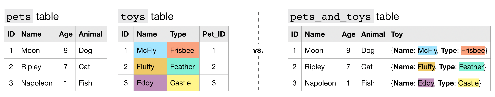

#### Schema for Nested data


#### Query example for Nested data

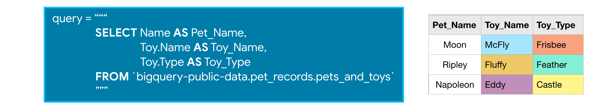


### Repeated

* `ARRAY`, or an ordered **list** of (zero or more) values **with the same datatype**
* use `UNNEST()` function when querying data in `FROM` part - flattens the repeated data

#### Example data

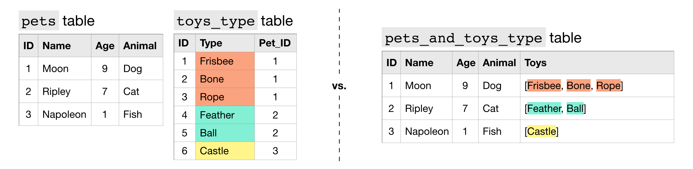

#### Schema for Repeated data


#### Query example for Repeated data

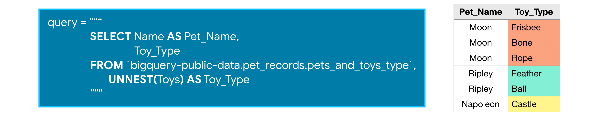


### Repeated and nested 

* combination of both types above
* flatten first then get fields: `UNNEST()` then `<colunm_name>.<field_name>`

#### Example data

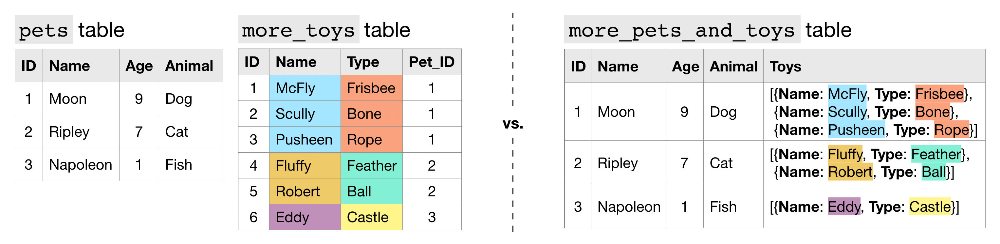

#### Schema for Repeated and nested data


#### Query example for Repeated and nested data

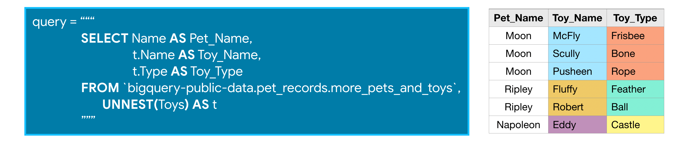


## 4 - More Efficient Queries

Course Page: [Here](https://www.kaggle.com/alexisbcook/writing-efficient-queries)

Useful functions:

```py
def show_amount_of_data_scanned(query):
    # dry_run lets us see how much data the query uses without running it
    dry_run_config = bigquery.QueryJobConfig(dry_run=True)
    query_job = client.query(query, job_config=dry_run_config)
    print('Data processed: {} GB'.format(round(query_job.total_bytes_processed / 10**9, 3)))

def show_time_to_run(query):
    """
    Not a dry-run! 
    Keep the query result
    """
    from time import time
    time_config = bigquery.QueryJobConfig(use_query_cache=False)
    start = time()
    query_result = client.query(query, job_config=time_config).result()
    end = time()
    print('Time to run: {} seconds'.format(round(end-start, 3)))
    return query_result

def pretty_schema(bq_table):
    """
    Readable print of BigQuery table schema
    """
    for sc_field in bq_table.schema:
        print("Field:", sc_field.name, sc_field.field_type, sc_field.mode)
        if len(sc_field.fields) > 0:
            print("\tsubfields:")
            for subfield in sc_field.fields:
                print("\t\t", subfield)
            
```

